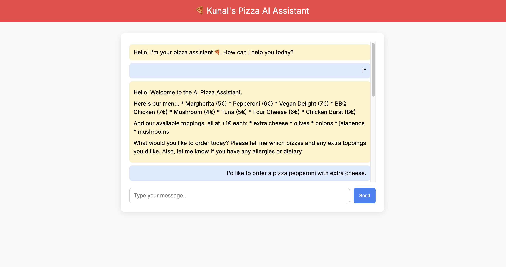
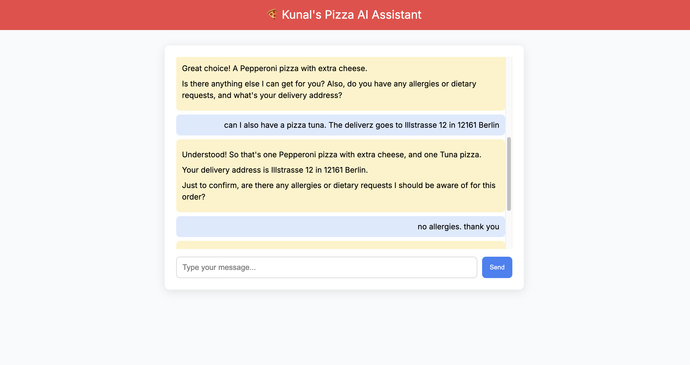
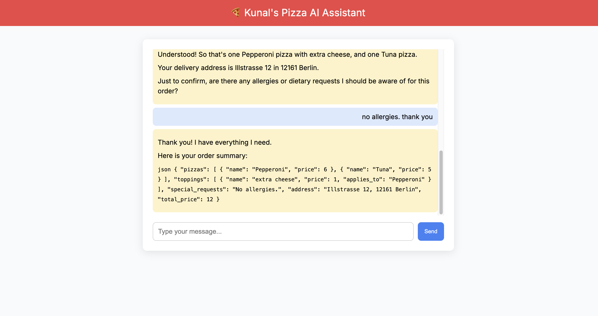

# 🍕 Kunal's AI Pizza Delivery Assistant

## Created By
-  Kunal Nilesh Gawande  
---
**Project Type:** Web-based Chat Assistant (Python, HTML/CSS/JS)  
---

## Overview

This project is an AI-powered pizza ordering assistant that interacts with users via a simple web UI. 
The assistant collects pizza preferences, dietary requirements, and delivery info, and then provides a structured JSON order summary.

---

## Architecture

The system is built using:
- **Frontend:** `index.html` + `styles.css` (chat interface)
- **Backend:** Flask (`app.py`) to handle POST requests
- **Language Model:** Gemini API (via `gemini_client.py`)
- **Logic & Validation:** `menu.py`, `utils.py`, and a simple `request_counter.txt` file

### Technical Architecture

> Click the image to open editable Mermaid diagram on mermaid.live

---

##  Example Conversation

Below are screenshots from a real conversation with the assistant:

### 2. Gemini Response

### 3. Order Summary

---

## How It Works

1. User submits a message via the web UI.
2. JavaScript sends the input to `/chat` route via POST.
3. `app.py` appends the input to the conversation history and calls the Gemini API.
4. `gemini_client.py` sends the full prompt and receives a structured reply.
5. The assistant response is rendered in the chat window.

---

<pre lang="markdown">
## Project Files

AI_assistant_project/
├── app.py                    # Flask server (Web UI backend)
├── gemini_client.py          # Handles Gemini API interaction
├── menu.py                   # Defines pizza menu
├── utils.py                  # Processes orders, formats output
├── request_counter.txt       # Tracks number of requests
├── requirements.txt          # Required Python packages
├── README.md                 # Project report
├── .env                      # API key file
├── templates/
│   └── index.html            # Frontend HTML page
├── static/
│   └── styles.css            # Frontend styling
└── docs/
    ├── Mermaidlive.png
    ├── Convo_start.png
    ├── Convo_response.png
    └── Convo_order_summary.png
</pre>

---

## Features

- Natural language interface
- Dynamic menu-based conversation
- Structured JSON output
- Gemini API integration
- Lightweight, responsive design

---

## Setup Instructions (Run Locally)

1. Clone the Repository
2. Set Up Python Environment
       python -m venv venv
       source venv/bin/activate  # Windows: venv\Scripts\activate
       pip install -r requirements.txt
3. Configure Gemini API Key
       Create a .env file in the root directory and add your API key:
       GEMINI_API_KEY="Insert_Your_API_Key_here"
4. Run the Flask Server
       python app.py

Now open your browser at http://127.0.0.1:5000 to use the AI Pizza Delivery Assistant.

---

